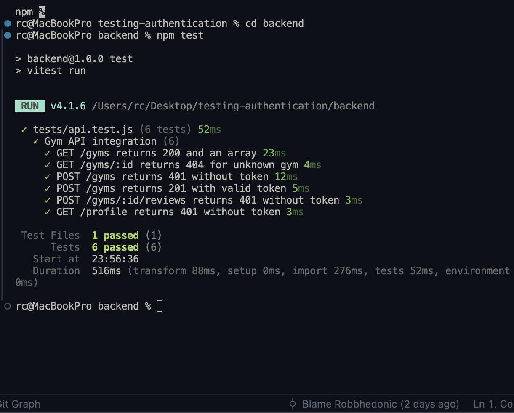
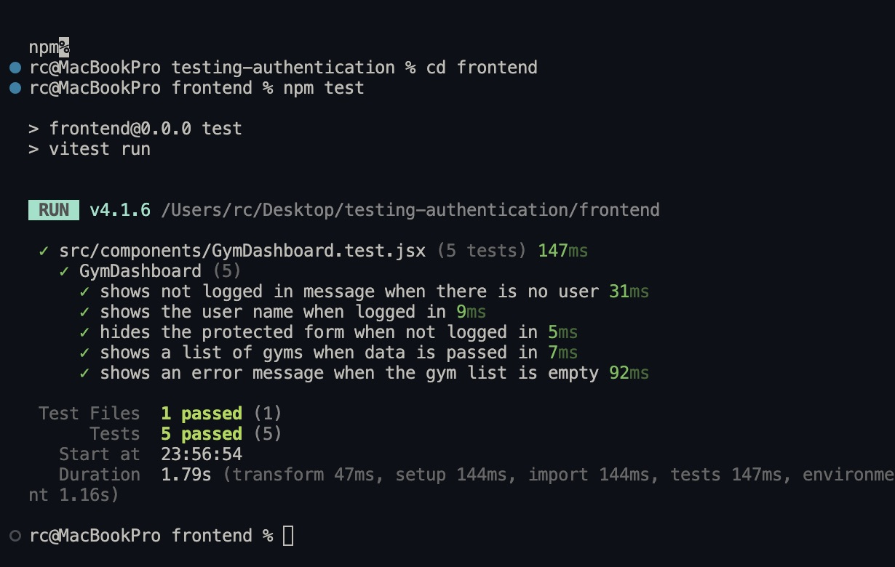
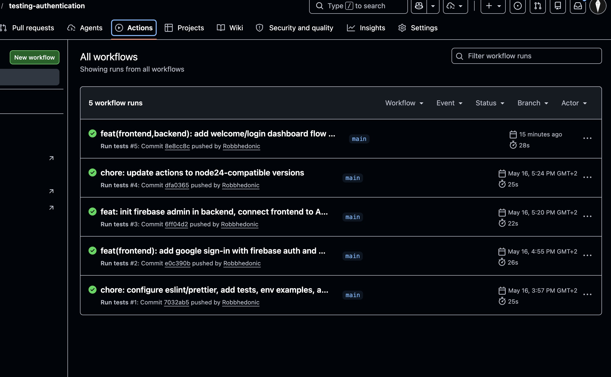

# Gym Review API

A REST API with authentication, integration and unit tests, and a CI pipeline via GitHub Actions.

---

## Setup

### Clone the repository
```bash
git clone https://github.com/Robbhedonic/testing-authentication.git
cd testing-authentication
```

### Install dependencies
```bash
# Backend
cd backend
npm install

# Frontend
cd ../frontend
npm install
```

### Configure environment variables

**Backend**:
```bash
cp backend/.env.example backend/.env
```

**Frontend**:
```bash
cp frontend/.env.example frontend/.env
```

Get Firebase config from Firebase Console:
1. Go to Project Settings (gear icon) > Web app
2. Copy the config object
3. Paste values into `.env`

Then enable Google sign-in:
1. Go to Authentication > Sign-in method
2. Enable **Google** provider
3. In Authorized domains, add `localhost` (for local dev)

### Run the project locally
```bash
# Backend (runs on http://localhost:3000)
cd backend
npm start

# Frontend (runs on http://localhost:5173)
cd frontend
npm run dev
```

---

## Testing

### Run tests locally
```bash
# Backend integration tests
cd backend
npm test

# Frontend unit tests
cd frontend
npm test
```

### Screenshots




---

## Authentication

**Provider chosen: Firebase with Google sign-in**

We chose Firebase because it provides token-based authentication that integrates cleanly with a REST API. The client authenticates via Google OAuth, receives a JWT (ID token), and sends it in the `Authorization: Bearer <token>` header on protected requests.

### How it works
1. User clicks "Login with Google" on the frontend
2. Firebase handles OAuth flow with Google
3. Firebase returns an ID token (JWT)
4. Frontend stores token in memory (not localStorage)
5. On API calls to protected routes, frontend sends: `Authorization: Bearer <token>`
6. Backend `verifyToken` middleware verifies token with `firebase-admin`
7. If valid, `req.user` is set; otherwise returns `401 Unauthorized`

---

## Security decisions

### No secrets in the repository
All API keys and credentials are stored in `.env` files which are listed in `.gitignore`. A `.env.example` file documents which variables are needed without exposing real values.

### Protected routes return 401
Unauthenticated requests to `POST /gyms`, `POST /gyms/:id/reviews`, and `GET /profile` return `401 Unauthorized`. This is verified by dedicated integration tests.

### CORS restricted to a specific origin
CORS is configured to only allow the configured frontend origin (`FRONTEND_ORIGIN`, default `http://localhost:5173`). A wildcard `*` is not used because that would allow any origin to make authenticated requests to the API.

### Tokens not stored in localStorage
Firebase tokens are kept in memory and not stored in `localStorage`. `localStorage` is accessible by JavaScript from any script on the page, making it vulnerable to XSS attacks.

### `withCredentials: true` on authenticated requests
All authenticated frontend requests use `withCredentials: true` so cookies and credentials are sent correctly with cross-origin requests.

### CI secrets in GitHub Actions
The workflow reads sensitive backend values from GitHub Secrets (`FIREBASE_PROJECT_ID`, `FIREBASE_CLIENT_EMAIL`, `FIREBASE_PRIVATE_KEY`, `FRONTEND_ORIGIN`) rather than hardcoding values in workflow files.

### Security checklist status
- [x] No secrets or API keys committed to the repository
- [x] Sensitive values in `.env` and variables documented in `.env.example`
- [x] Protected routes return `401 Unauthorized` when unauthenticated
- [x] CORS restricted to frontend origin (no wildcard)
- [x] Tokens not stored in `localStorage`
- [x] Authenticated frontend requests send `withCredentials: true`

---

## Reflections

### Implementation choices
- **In-memory array** for data storage — the focus of this project is testing and authentication, not database design. An in-memory store keeps the setup simple and makes tests fast and predictable.
- **Firebase** over Auth0 — token-based auth is a better fit for a stateless REST API. It avoids session management and works well with the `Authorization` header pattern.
- **Vitest** for both backend and frontend — consistent tooling across the project, fast execution, and native ES module support.

### What was challenging
- Mocking `firebase-admin` in integration tests so they can run without real Firebase credentials in CI.
- Configuring CORS correctly so the frontend can send authenticated requests with credentials.

### What we would do differently
- Use a real database (PostgreSQL or MongoDB) with migrations for a production-ready setup.
- Add refresh token handling on the frontend for longer sessions.
